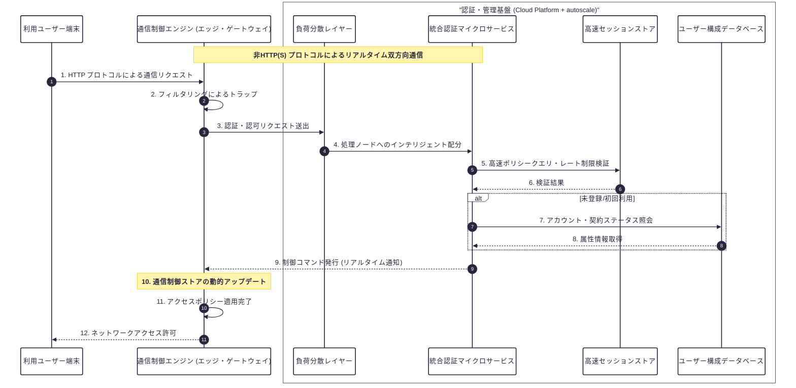

# こんにちは、swjone です 👋

　自営含め25年以上、IT業務に幅広く従事してきました。
「開発そのもの（モノづくり）」以上に、お客様とのコミュニケーションを大切にし、実際に手（足？）を動かして問題を解決することを大切にしています。

I have over 25 years of experience in the IT industry, including running my own business. My true passion lies in "monozukuri" (the art of making things), but I value client communication above all else. I pride myself on being a hands-on problem solver who isn't afraid to get out into the field to get the job done.

### 🛠 私ができること
* **現場の構築:** 第二種電気工事士所持。物理的な配線工事、管理・監督から、ルーター・スイッチ、AP（100台規模）の設計、設定～設置まで。 （勿論、各種ドキュメント（NW構成図、設定シート、テスト仕様書なども対応含むです））
* **低レイヤー開発:** C言語とミドルウェアを用いた、OSレベルでの高速なパケット制御システムの構築。
* **Webの仕組み作り:** 昔ながらのLAMP環境（25年以上）から最新のGoogle Cloud、NestJSを用いたリアルタイム通信まで。（サイト構築実績: ECサイト、キャンペーンサイト、ブランドサイトなど 100サイト前後）
* **ビジネスの全工程:** お客様への提案から要件定義、設計、開発、テスト、納品、そして請求まで一人で完結できます。

### Field Engineering & Infrastructure:
Licensed Second-Class Electrician. Full-stack infrastructure support from physical cabling and onsite supervision to the design, configuration, and installation of routers, switches, and large-scale Access Points (100+ units).
(Includes full documentation: NW diagrams, configuration sheets, and test specifications.)

### Low-Level Development:
Building high-speed, OS-level packet control systems using C and custom middleware.

### Web Architecture & Development:
From 25+ years of experience with traditional LAMP stacks to modern real-time communication systems using Google Cloud and NestJS. (Proven track record of 50–60 projects, including E-commerce, campaign, and brand sites.)

### End-to-End Business Solutions:
I handle the entire lifecycle solo—from initial client proposals and requirements definition to design, development, testing, delivery, and billing.
(In an era where many struggle to visualize logic flows, I prioritize rigorous logic organization. I believe any lack of clarity here leads directly to a drop in QoS.)

### 🚀 現在取り組んでいる仕組み（構想+α）
　低遅延な認証ゲートウェイとクラウドを連携させ、リアルタイムで通信を制御する仕組みを開発中です。
この基盤を応用し、金融商品関連システム、運行管理システムにおける高速な信号処理連携も視野に入れています。

* **ポイント** 超低レイテンシ、高可用性 に重点を置いています。開発環境でエッジ・ゲートウェイ～サーバー迄の最低限の通信検証済みです。

## リアルタイム認証システムシーケンス

### 💻 道具（技術）
* **OS:** Win, Linux(Redhat系) , OpenWRT など ※. 開発PCはWin, Almalinux 9 （2026/02 現在）
* **言語の経験:** PHP, NestJS (TypeScript), JS（jQueryなど）, sh, dos, C, Perl, VB, COBOL （HTML, CSS ← プログラム言語ではないですが）
* **DB:** MySQL, MSSQL, Accessなど
* **フレームワーク:** Zendフレームワーク（ZF1, ZF2 ※. 古いですが）, Smarty, FuelPHP, Laravel など
* **インフラ:** AWS（EC2, S3, RDS）, Google Cloud, Linux (Apache/MySQL), さくらのVPS（Sakura VPS）
* **開発環境・作業ツール:** GitHUB, Docker, VS Code, さくらエディタ（ずっと使ってます）, Winmerge
* **その他ツール:** Redmine, Backlog, Teams, Slack, Chatworkとか
* **解析・運用保守:** AWS CloudWatch, Cisco Meraki, Omada cloud, Netmeistar, Wireshark によるパケット解析なども対応します、現地導入支援オンサイト対応もいたします。
* **デザイン:** Photoshop, Illustrator（印刷用データ作成も可能）, Figma, UI設計とか
* **直近の課題解決対応など:** 業務申請システムにおけるパフォーマンス改善（90秒以上/ページ → 0.5秒/ページ（約180倍の高速化達成））

---
　ご要望、ご希望などできる事は何でもやります。（L1 ～ L7 迄？）
「昔のシステムを最新のクラウドに載せ替えたい」「現場とソフトの両方がわかる人間が必要だ」といった、幅広いご相談に対応します。
